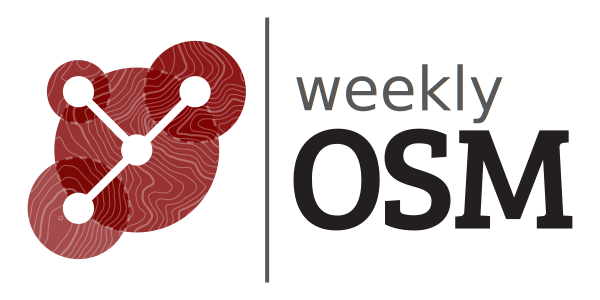

<!-- スライド1: タイトル -->
<!-- _class: gaia lead -->
<!-- _paginate: false -->
<!-- _header: '' -->
<!-- _footer: '' -->

# 週刊OSM編集の裏側
## State of the Map Japan 2024
### 三浦広志

---

## 著者略歴
- 2007年に日本で最初にOpenStreetMapの普及活動を開始
- プロフェッショナル向け翻訳ツールOmegaTのリード開発者
- 週刊OSMの編集者として活動

---

## 目次
1. 週刊OSMとは？
2. 2024年の代表的な記事
3. 週刊OSMの編集プロセス
4. 翻訳作業の裏側
5. まとめ & OSMへの貢献方法

---

<!-- スライド5: 週刊OSMの目的 -->

## 週刊OSMとは？
- **OSMの最新ニュースを提供**
- 経験者から初心者まで**すべてのOSMメンバー向け**
- 多言語で提供（翻訳者の協力が必須）
- 組織や企業から独立
- **年間52号 (休みなし) の発行**
- [最新号はこちら](https://weeklyosm.eu/)

---

## 2024年の代表的な記事

### 週刊OSMは10周年
- **742号（2024年10月）**
- 2014年10月7日、多言語版の第一号発行
- 
---

### State of the Map 2024の模様
- **739号（2024年9月）**  SotM 2024の集合写真
- 

---

### OSM20周年記念記事
- **734号（2024年8月）**
- **Steve Coastのメッセージ**
  - 「OSMは無料で世界地図を作るプロジェクトへと成長」
- **リチャード・フェアハーストの回想**
  - 「2024年ではOSMを始めるのは難しかったかも」

---

## 週刊OSMの編集プロセス

### 情報収集
- OSMBC（Webベースの編集プラットフォーム）を使用
- 記事のタレコミ: [投稿ページ](https://weeklyosm.eu/ja/this-news-should-be-in-weeklyosm)
- リンクは 週刊OSMページの右上にあります
- 使えるURLの例: OSM日記 Mastodon BlueSky Note Zenn

---

### 記事編集
- 英語で記事作成
- AI生成記事や広告目的の偽情報をチェック
- 公開情報（ログイン不要）へのリンク必須

---

## 翻訳作業の裏側

### 翻訳の流れ
- 月～金: 記事収集
- 金～日: 翻訳・推敲
- 公開: 日曜夕方（欧州時間）

---

### 使用ツール
- **DeepL, NICT TexTra, Microsoft Azure**（機械翻訳）
- **OmegaT**（翻訳プロ向けツール）
  - Markdown形式で翻訳
  - [翻訳データ管理](https://codeberg.org/miurahr/osmweekly-ja-omegat)

---

### レビューと公開条件
- 翻訳後、複数名でレビュー＆推敲
- 証跡としてレビューコメントを記録
---

<!-- スライド11: 結論 -->

## まとめ & WeeklyOSMへの貢献方法

- **週刊OSMはOSMの重要な情報源**
- **多言語での編集は、コミュニティの協力で成り立つ**
- **OSMERS FukushimaのYouTube配信**で週刊OSMを楽しもう
  - [チャンネルはこちら](https://www.youtube.com/@osmersfukushima4411)

---

<!-- スライド12: 連絡先 -->

## ありがとうございました！

- **記事の投稿・編集にぜひ参加してください！**
- **質問や感想をお聞かせください！**
- slide: https://miurahr.github.io/sotmjp2024-keynote/
- Mastodon: @miurahr

---

<!-- Add this anywhere in your Markdown file -->
