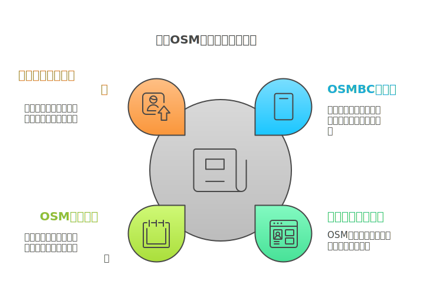
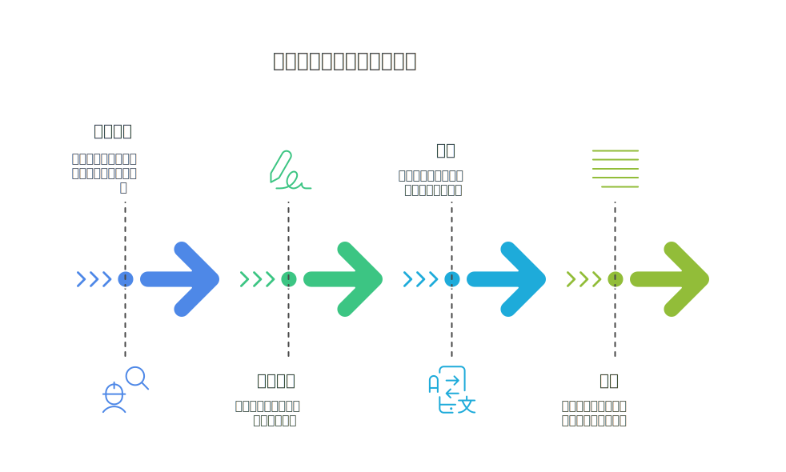
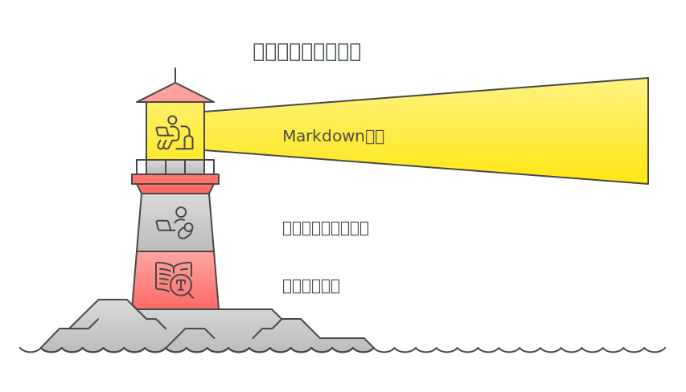

<!-- スライド1: タイトル -->
<!-- _class: gaia lead -->
<!-- _paginate: false -->
<!-- _header: '' -->
<!-- _footer: '' -->

# 週刊OSM編集の裏側
## State of the Map Japan 2024
### 三浦広志

---

## 目次
1. 講演者紹介
2. 週刊OSMとは？
3. 2024年の代表的な記事
4. 週刊OSMの裏側
5. 記事の編集と公開プロセス
6. まとめ

---

<!-- 講演者紹介 -->

**略歴**
* 2007年OpenStreetMapを日本に紹介
* フリーのプロ用翻訳ツールOmegaTのリード開発者
* Wikiや週刊OSMの編集活動
* 一社)オープンストリートマップ ファウンデーション ジャパン 代表理事
* NTTDATAとIOWN Global Forumで、IOWNを推進
* LinkedIn(@miurahr)

---

<!-- 週刊OSMの目的 -->

## 週刊OSMとは？

**OSMの最新ニュースを提供**
- 経験者から初心者まで**すべてのOSMメンバー向け**
- 多言語で提供（翻訳者の協力が必須）
- 組織や企業から独立
- **年間52号 (休みなし) の発行**
- [最新号はこちら](https://weeklyosm.eu/)

---

## 2024年の代表的な記事

### 週刊OSMは10周年
- **742号（2024年10月）**
- 2014年10月7日、多言語版の第一号発行
 
---

### State of the Map 2024の模様
- **739号（2024年9月）** では、 SotM 2024の集合写真
- 

---

### OSM20周年記念記事
- **734号（2024年8月）** **Steve CoastのEssay**を紹介
- "The Days are Long but the Years are Short  OpenStreetMap at 20"
- 「20年間の旅を振り返り、大胆なアイデアから、無料で世界地図を作成するグローバルなボランティア主導のプロジェクトへと成長したと語りました。」
- https://blog.openstreetmap.org/2024/08/09/openstreetmap-at-20/

---

### 創設は2004年、Google Maps開始前

黎明期のふりかえりが記事になりました.

- "リチャード・フェアハースト氏は、OpenStreetMapの黎明期を振り返り、2024年にOSMを始めることはできなかっただろうと指摘しました。"
- "プロジェクトの初期段階で、Googleによって潰されたり、RedditやHacker Newsユーザーの「なぜまだ良くないのか」という記事が立ったり、プライバシーをめぐる論争や国境紛争で炎上したりしたことでしょう"

---

### 今週の画像で日本の活動も紹介

- **723号(2024年6月)** OSM福島
- 

---

# 週刊OSMの裏側

---

-
- [トピック投稿リンク](https://weeklyosm.eu/ja/th‘Ｒis-news-should-be-in-weeklyosm)

---

-

---

### わたしの翻訳方法

- **OmegaT**（翻訳プロ向けツール）を使用
- 

---

### 作業イメージ

<iframe src="https://player.vimeo.com/video/1054512440?badge=0&amp;autopause=0&amp;player_id=0&amp;app_id=58479" width="800" height="443" frameborder="0" allow="autoplay; fullscreen; picture-in-picture; clipboard-write; encrypted-media" title="osmbc-demo-2025-02-07_11.54.39"></iframe>

---

### 週刊OSMのチーム

- 

---

<!-- スライド11: 結論 -->

## まとめ

- **週刊OSMはOSMの重要な情報源**
- **多言語での編集は、コミュニティの協力で成り立つ**
- **記事の投稿・編集にぜひ参加してください！**

- slide: https://miurahr.github.io/sotmjp2024-keynote/

