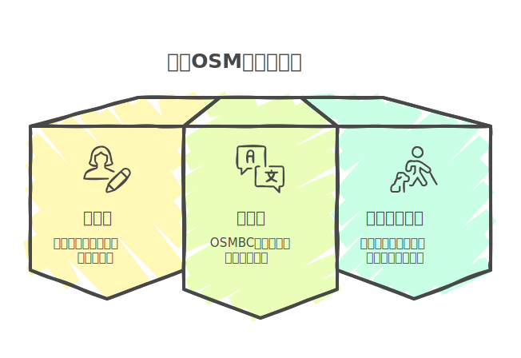

<!-- スライド1: タイトル -->
<!-- _class: gaia lead -->
<!-- _paginate: false -->
<!-- _header: '' -->
<!-- _footer: '' -->

# 週刊OSM編集の裏側
## State of the Map Japan 2024
### 三浦広志

---

## 目次
1. 講演者紹介
2. 週刊OSMとは？
3. 2024年の代表的な記事
4. 週刊OSMの裏側
5. 記事の編集と公開プロセス
6. まとめ

---

<!-- 講演者紹介 -->

**略歴**
- 2007年に日本で最初にOpenStreetMapの普及活動を開始
- プロフェッショナル向け翻訳ツールOmegaTのリード開発者
- 週刊OSMの編集者として活動

---

<!-- 週刊OSMの目的 -->

## 週刊OSMとは？
- **OSMの最新ニュースを提供**
- 経験者から初心者まで**すべてのOSMメンバー向け**
- 多言語で提供（翻訳者の協力が必須）
- 組織や企業から独立
- **年間52号 (休みなし) の発行**
- [最新号はこちら](https://weeklyosm.eu/)

---

## 2024年の代表的な記事

### 週刊OSMは10周年
- **742号（2024年10月）**
- 2014年10月7日、多言語版の第一号発行
 
---

### State of the Map 2024の模様
- **739号（2024年9月）** では、 SotM 2024の集合写真
- 

---

### OSM20周年記念記事
- **734号（2024年8月）** **Steve Coastのメッセージ**を紹介
- 「OSMは20年間の旅を振り返り、大胆なアイデアから、無料で世界地図を作成するグローバルなボランティア主導のプロジェクトへと成長したと語りました。」

---

### 創設は2004年、Google Maps開始前

黎明期のふりかえりが記事になりました.

- "リチャード・フェアハースト氏は、OpenStreetMapの黎明期を振り返り、2024年にOSMを始めることはできなかっただろうと指摘しました。"

---

### リチャード・フェアハーストの回想

- "プロジェクトの初期段階で、Googleによって潰されたり、RedditやHacker Newsユーザーの「なぜまだ良くないのか」という記事が立ったり、プライバシーをめぐる論争や国境紛争で炎上したりしたことでしょう"

---

### 日本の活動紹介
- **723号(2024年6月)** OSM福島
- 

---

## 週刊OSMの裏側

### 情報収集
- OSMBCというブログ編集ツールに似た Webベースの編集プラットフォームを使用。
- ブログやニュース、www.openstreetmap.orgの日記機能を参照。
- トピック投稿ページ: [週刊OSMへのトピック投稿リンク](https://weeklyosm.eu/ja/th‘Ｒis-news-should-be-in-weeklyosm)

---

### 記事の編集作業

- 編集者が集められたリンク先情報をもとにニュース原稿を作成。
- 記事を理解し、偽記事ではないか、をチェック。
- 公開された情報のみをリンク。

---

### 記事の翻訳作業

- 各国の翻訳者が記事を翻訳。
- 月曜から金曜に情報収集、土曜から日曜に推敲と翻訳。
- 翻訳には、 **DeepL, NICT TexTra, Microsoft Azure** の機械翻訳サービスを使用。

---

### わたしの翻訳方法

- **OmegaT**（翻訳プロ向けツール）を使用
- Markdown形式で翻訳し、OSMBCに反映
- [翻訳プロジェクト](https://codeberg.org/miurahr/osmweekly-ja-omegat)を公開で実施。
- 用語集や過去の対訳のDBを公開しているので、参加者はすぐに翻訳にはいれる。

---

### 作業イメージ

<iframe width="560" height="315" src="https://www.youtube.com/embed/8WFXLxX-Dqo?si=3q7UHBDaVn5DCKoe" title="YouTube video player" frameborder="0" allow="accelerometer; autoplay; clipboard-write; encrypted-media; gyroscope; picture-in-picture; web-share" referrerpolicy="strict-origin-when-cross-origin" allowfullscreen></iframe>

---

### 記事の公開条件
- 複数名でのレビューと推敲が必須。

---

### 週刊OSMのチーム

- 

---

<!-- スライド11: 結論 -->

## まとめ

- **週刊OSMはOSMの重要な情報源**
- **多言語での編集は、コミュニティの協力で成り立つ**
- **記事の投稿・編集にぜひ参加してください！**

- slide: https://miurahr.github.io/sotmjp2024-keynote/

---

<!-- Add this anywhere in your Markdown file -->
